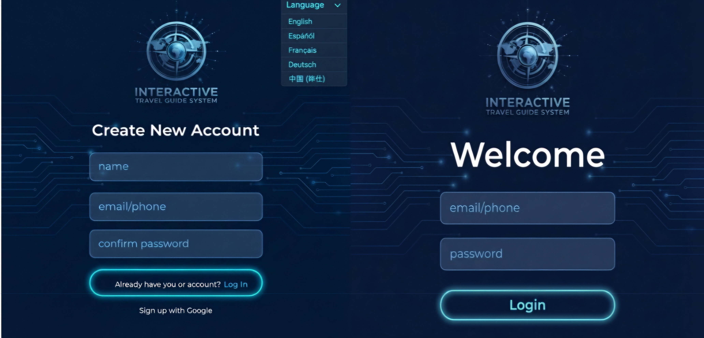
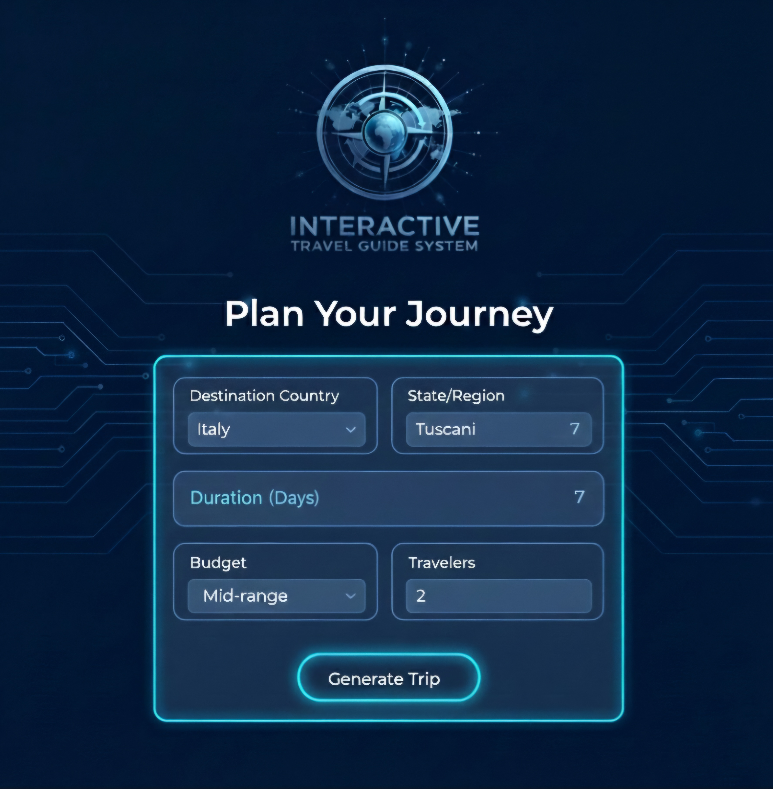
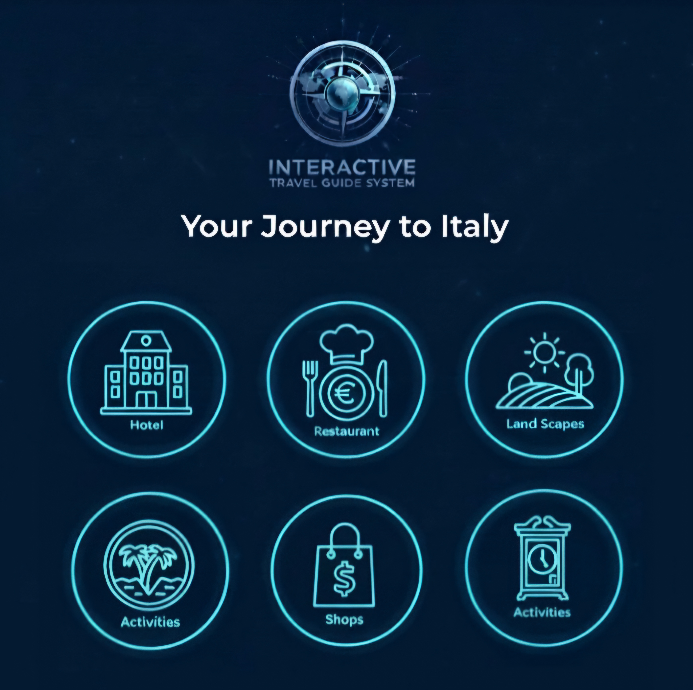
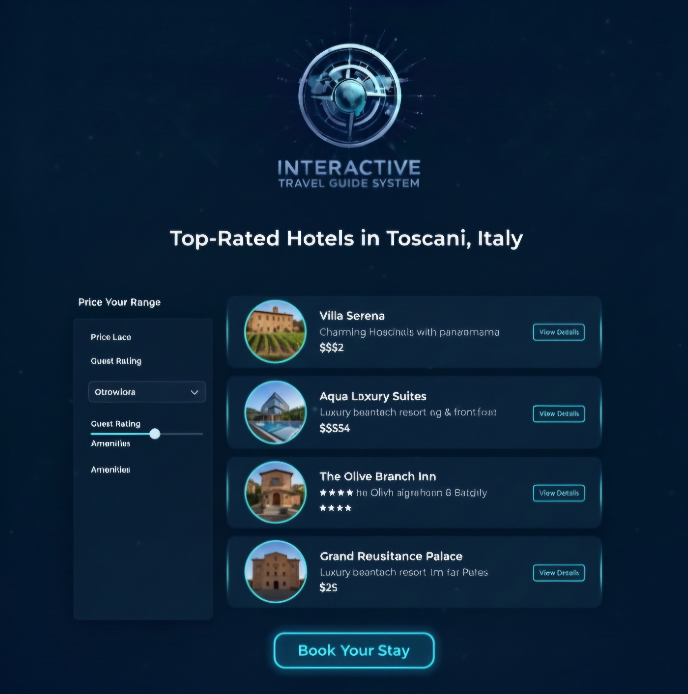
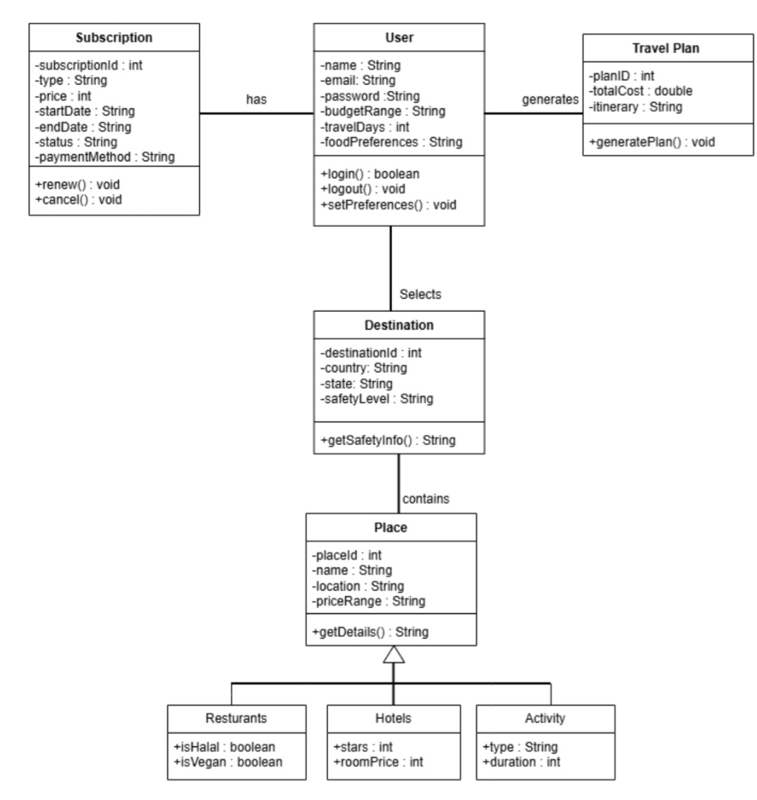

# Interactive Travel Guide System

This project was created for the I3301 Software Engineering course at Lebanese University.

The idea of the project is to help users plan their trips in an easier way. The user can choose a destination, budget, number of days, and some personal preferences, and the system prepares a travel plan based on these choices.

## Main Features

- Sign up and login
- Choose a travel destination
- Set a budget and trip duration
- Choose preferences such as restaurants, hotels and activities
- Generate a personalized travel plan
- Edit the generated plan
- Show safety warnings for some destinations
- Search and filter different places

## Software Engineering Work

During this project, I worked on:

- Requirements gathering
- Functional and non-functional requirements
- Use cases
- UML diagrams
- Database design
- User interface design
- Security requirements

## Database

I designed a relational database for the system.

Some of the main entities are:

- User
- Destination
- Place
- Restaurant
- Hotel
- Activity
- Travel Plan
- Subscription

## Future Improvements

Some features that could be added later are:

- Better personalization
- Multiple languages
- Booking services
- Offline access
- Improved mobile interface

## Project Screenshots

### Login and Registration

### Plan Your Journey

### Journey Categories

### Hotel Recommendations

## System Design

### Use Case Diagram

### UML Class Diagram

